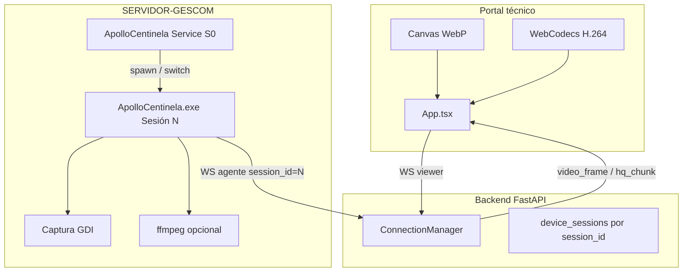
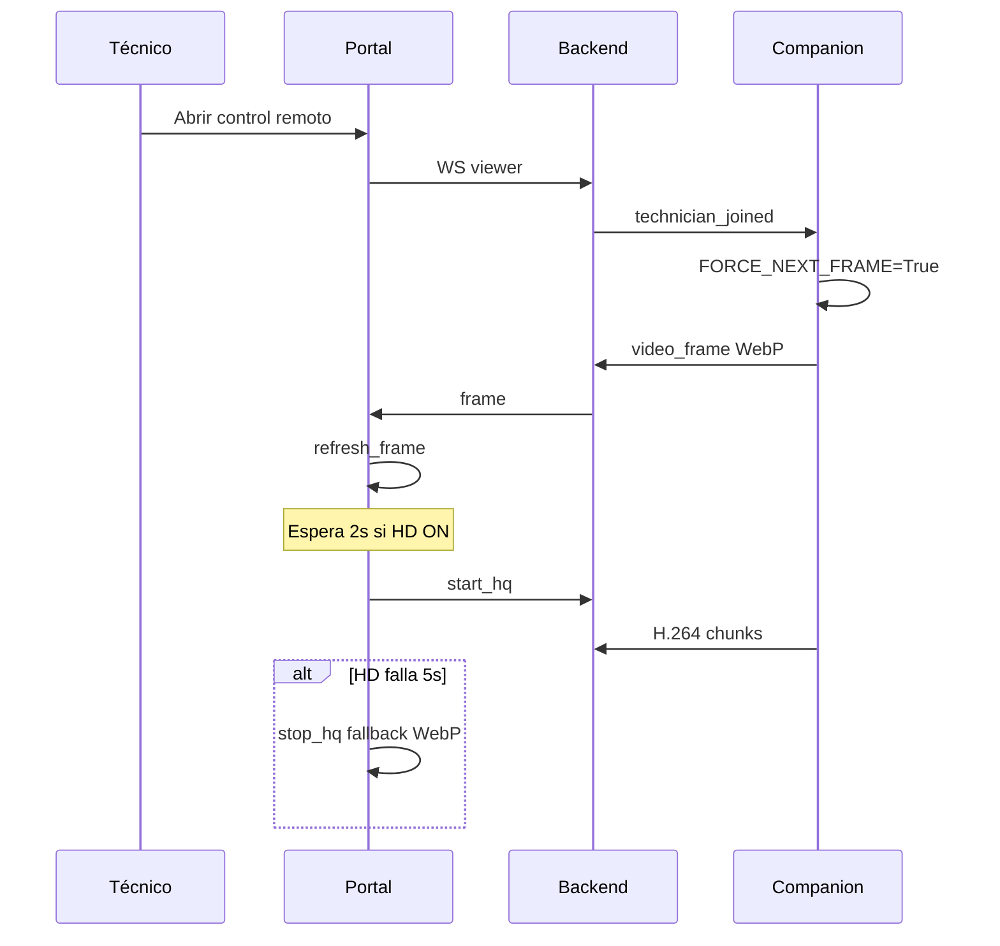
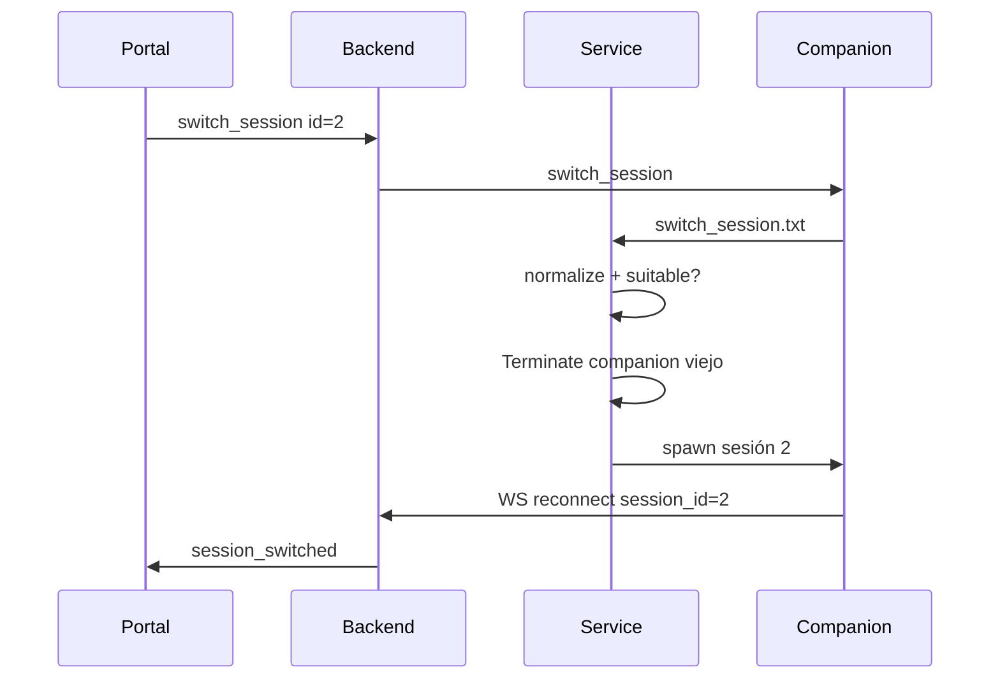

# Arquitectura — Control remoto ApolloSupport

## Diagrama de componentes

## Secuencia: conectar visor

## Secuencia: cambio de sesión

## Estados del companion (servicio)

| Estado | `_pinned_session` | Comportamiento monitor |
|--------|-------------------|-------------------------|
| Auto | `None` | `resolve_companion_session_id()` → consola o RDP con token |
| Tras switch UI | `N` | Mantener N si `session_suitable` |
| Disc pinned | desanclado | Warning + fallback a sesión apta |

## Tipos de mensaje WS relevantes

| Tipo | Dirección | Uso |
|------|-----------|-----|
| `video_frame` | Agente → Viewer | WebP base64, opcional `delta` |
| `hq_chunk` | Agente → Viewer | Binario H.264 |
| `technician_joined` | Backend → Agente | Inicia captura / frame fresco |
| `refresh_frame` | Viewer → Agente | `FORCE_NEXT_FRAME` |
| `start_hq` / `stop_hq` | Viewer ↔ Agente | Modo HD |
| `switch_session` | Viewer → Agente → Service | Reinicio companion |
| `session_list` | Agente → Viewer | Lista `query session` |

## Rutas de archivos en producción

| Ruta | Contenido |
|------|-----------|
| `C:\Program Files (x86)\Apollo Centinela\` | Exes + ffmpeg |
| `C:\ProgramData\ApolloSupport\service.log` | Servicio |
| `C:\ProgramData\ApolloSupport\centinela.log` | Companion |
| `C:\ProgramData\ApolloSupport\switch_session.txt` | Señal switch (efímero) |
| Portal htdocs | `frontend/dist/` |

## Puntos de extensión seguros

1. **Calidad WebP:** `set_stream_params` (`max_width`, `webp_still`, `webp_motion`).
2. **HD:** parámetros ffmpeg en `hq_stream_loop`.
3. **Sesiones:** mejorar parser `get_windows_sessions()` (locale, columnas).
4. **Telemetría:** FPS y `session_id` en bitácora ya parcialmente en logs.

---

Ver runbook: `CONTROL_REMOTO_RUNBOOK.md`.
